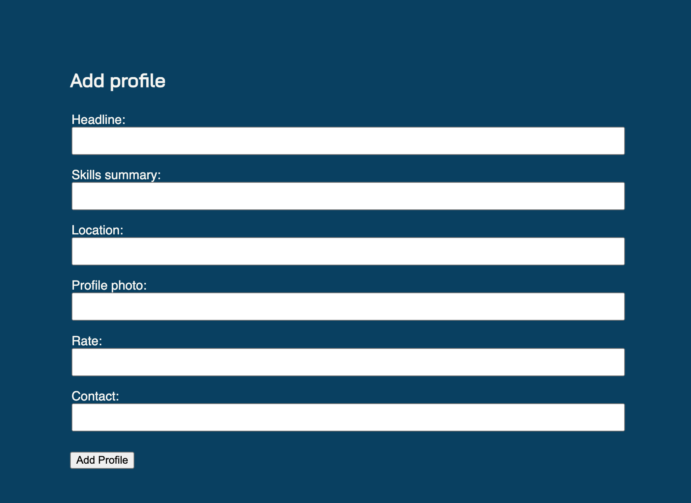
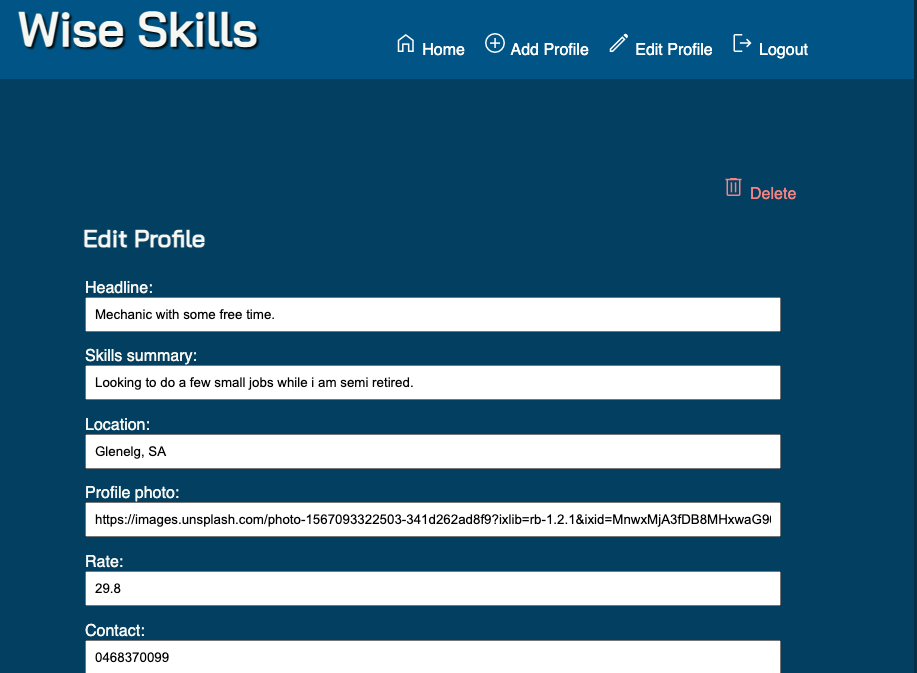
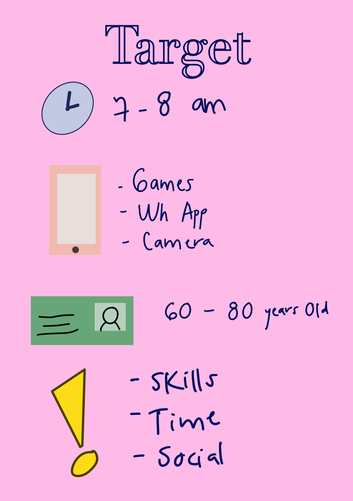
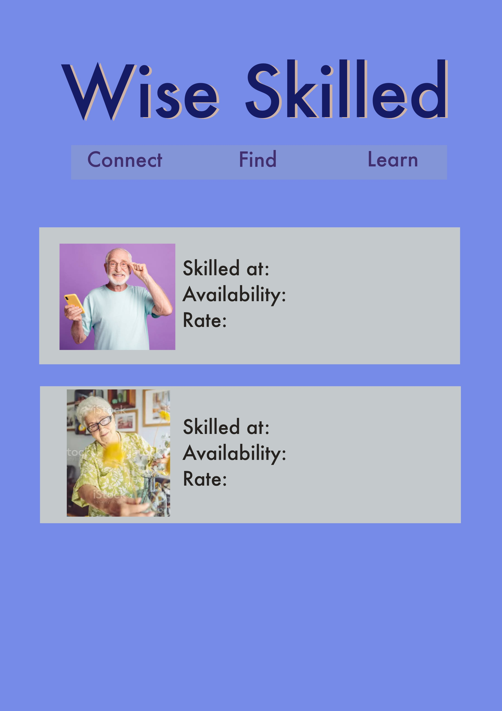

# Wise skills App
Wise Skills App is an application for elderly people to offer their services, experience and receive money or other services in exchange. This entire App was built by JAA Team where we worked from back-end to middleware to front-end tools.

## :computer: [Click here](https://wise-skills-app.herokuapp.com/) to see my live project!

## :speech_balloon: About
- All profiles can remain public access.
- The user can create an account with basic data such as name, email and create a password of at least 8 characters.
- When the user logs in, they can create a profile with the following fields to fill out.

- The user also has the possibility to delete the profile, and to add a new one.
- There is an option to edit a current profile, all fields are editable.

## :memo: Planning:
## Sketchs for the initial idea:
- There are the sketchs used to start the project.

- Working in a team of 3 people, we drew up a plan as follows:
1) Discuss and clarify the idea and goals of the application
2) Map out workflow and divide tasks.
3) We established a time frame od 1 days to obtain the minimum characteristics of the application.
4) After getting the mvp ready, we worked on the design and extra features for the application (minimum length characters for the password, functions to edit, delete, add new profiles).

## :rocket: Cool tech
- Node
- Express (http://localhost:3000/)
- Animations on CSS
- Libraries
- Trello
- package.json
- The App is responsive and the appearence.
- The appearance of the navigation bar is different for the mobile version and for the desktop version.

## :scream: Bugs to fix :poop:
- When you edit it only shows after you refresh.
- Text is overflowing for headline

## :sob: Lessons learnt
- We learned to work in different branches on the terminal.
- To work on Github in collaboration and having the Upstream (The person managing the merging of work on Git.)
- To work on functions to apply based on conditions such as if they are registered what I allow them to do ans see. For example; delete and edit.
- To write functions readable for others so they can continue working on them.
- To manage time as a team

## :National Park: Future features
- An instant pop message for users when they need help with their account.
- A payment method. 
- Search bar.
- Top skills. 
